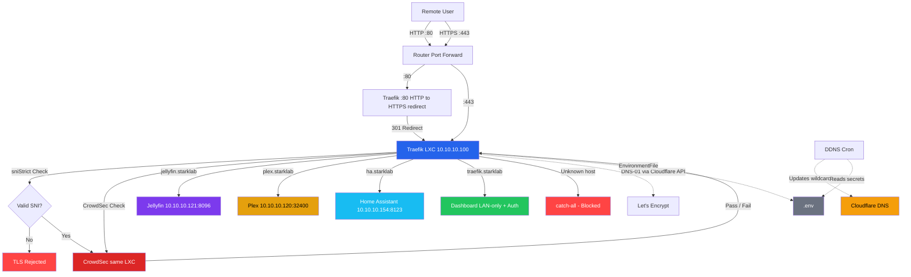

# Traefik Core Setup — StarkLab Reverse Proxy

> **Do this once.** After this guide, all future services just need a YAML file drop + `deploy.sh`.

## Architecture



**Everything runs natively inside one LXC — no Docker.**

## Proxmox Environment

| CTID | Name | IP |
|------|------|-----|
| **100** | **Traefik** | **10.10.10.100** |
| 110 | SMB Server | 10.10.10.110 |
| 111 | qBittorrent | 10.10.10.111 |
| 112 | AutoBrr | 10.10.10.112 |
| 113 | RareSolver | 10.10.10.113 |
| 120 | Plex Server | 10.10.10.120 |
| 121 | Jellyfin Server | 10.10.10.121 |
| 130 | Immich | 10.10.10.130 |
| 150 | Home Assistant | 10.10.10.154 |

---

## Step 1: Install Traefik LXC

Use the Proxmox community helper script: [community-scripts.org/scripts/traefik](https://community-scripts.org/scripts/traefik)

- **CTID:** 101
- **Hostname:** traefik
- **IP:** 10.10.10.100
- **OS:** Debian 13
- **RAM:** 512 MiB
- **Disk:** 2 GB
- **Nesting:** Enabled

### Verify

```bash
ssh root@10.10.10.100
systemctl status traefik
```

Should show `active (running)`.

---

## Step 2: Create Cloudflare API Token

1. Go to [Cloudflare API Tokens](https://dash.cloudflare.com/profile/api-tokens)
2. Click **Create Token** → **Custom Token**

### Permissions

| Permission | Access |
|------------|--------|
| Zone → **DNS** → **Edit** | For DNS-01 challenge + DDNS |
| Zone → **Zone** → **Read** | To list zones |

### Zone Resources

| Resource | Value |
|----------|-------|
| Include | Specific zone → **mkroshana.com** |

Save the token securely — you'll add it to `.env` in Step 4.

> **Verify:** Token summary shows `Zone:DNS:Edit` and `Zone:Zone:Read` for `mkroshana.com`

---

## Step 3: Set Up Wildcard DNS

In Cloudflare → **mkroshana.com** → **DNS** → **Records**:

| Type | Name | Content | Proxy Status | TTL |
|------|------|---------|--------------|-----|
| A | `*.starklab` | `YOUR_PUBLIC_IP` | **DNS only** ☁️ | Auto |

> [!CAUTION]
> **MUST be DNS only (grey cloud).** Cloudflare ToS prohibits streaming media through their CDN.

This single wildcard record covers **all** subdomains: `jellyfin.starklab`, `plex.starklab`, `ha.starklab`, `traefik.starklab`, and any future services.

### Verify

```bash
nslookup jellyfin.starklab.mkroshana.com 1.1.1.1
nslookup plex.starklab.mkroshana.com 1.1.1.1
nslookup ha.starklab.mkroshana.com 1.1.1.1
# All should return the same IP
```

---

## Step 4: Configure Environment File

### 4.1 Clone the repo on the Traefik LXC

```bash
ssh root@10.10.10.100
cd /opt
git clone <YOUR_REPO_URL>   # clones into /opt/stark-lab
cd /opt/stark-lab/traefik-setup
```

### 4.2 Create the `.env` file

```bash
cp .env.example .env
nano .env
```

Fill in your real values:

```bash
# -- Cloudflare --
# Used by DDNS script
CF_API_TOKEN=<your_cloudflare_api_token>
# Used by Traefik (DNS Challenge)
# You can use the same token for both
CF_DNS_API_TOKEN=<your_cloudflare_api_token>
CF_ZONE_API_TOKEN=<your_cloudflare_api_token>

CF_ZONE_NAME=mkroshana.com
CF_RECORD_NAME=*.starklab.mkroshana.com

# -- ACME / Let's Encrypt --
ACME_EMAIL=admin@mkroshana.com

# -- CrowdSec --
# Leave placeholder for now — you'll generate this in Step 6
CROWDSEC_BOUNCER_API_KEY=placeholder

# -- Dashboard Auth --
# Leave placeholder for now — you'll generate this in Step 7
DASHBOARD_AUTH_HASH=placeholder

# -- Optional --
CF_PROXIED=false
CF_TTL=120
```

> [!IMPORTANT]
> The `.env` file contains all secrets. It is **never committed to git** (excluded by `.gitignore`). Store a backup securely.

### 4.3 Set file permissions

```bash
chmod 600 .env
```

---

## Step 5: Prepare Directories

```bash
mkdir -p /etc/traefik/conf.d
mkdir -p /etc/traefik/ssl
touch /etc/traefik/ssl/acme.json
chmod 600 /etc/traefik/ssl/acme.json
mkdir -p /var/log/traefik
```

**Don't deploy yet** — install CrowdSec first.

---

## Step 6: Install CrowdSec

### 6.1 Install

```bash
curl -s https://install.crowdsec.net | sh
apt update && apt install -y crowdsec
```

### 6.2 Change LAPI port (avoids conflict with Traefik dashboard)

```bash
nano /etc/crowdsec/config.yaml
```

Find `api` → `server` → `listen_uri` and change to:

```yaml
api:
  server:
    listen_uri: 127.0.0.1:6060
```

Also update the credentials file:

```bash
nano /etc/crowdsec/local_api_credentials.yaml
```

Change `url` to:

```yaml
url: http://127.0.0.1:6060/
```

### 6.3 Install collections

```bash
cscli collections install crowdsecurity/traefik
cscli collections install crowdsecurity/http-cve
cscli collections install crowdsecurity/base-http-scenarios
```

### 6.4 Configure log acquisition

```bash
cat > /etc/crowdsec/acquis.d/traefik.yaml << 'EOF'
source: file
filenames:
  - /var/log/traefik/traefik-access.log
labels:
  type: traefik
EOF
```

### 6.5 Start CrowdSec and generate bouncer key

```bash
systemctl restart crowdsec
systemctl status crowdsec

# Generate the API key for Traefik's bouncer plugin
cscli bouncers add traefik-bouncer
```

**Copy the key** and add it to your `.env`:

```bash
cd /opt/stark-lab/traefik-setup
nano .env
# Set: CROWDSEC_BOUNCER_API_KEY=<the_key_from_above>
```

### Verify

```bash
cscli bouncers list         # Should show: traefik-bouncer
cscli lapi status           # Should show: connected on port 6060
cscli collections list      # Should show installed collections
```

---

## Step 7: Generate Dashboard Password

### 7.1 Install htpasswd utility

```bash
apt install -y apache2-utils
```

### 7.2 Generate the password hash

```bash
htpasswd -nb admin YOUR_SECURE_PASSWORD
```

This outputs something like: `admin:$apr1$xyz123$abcdefghijklmnop`

### 7.3 Add to `.env`

```bash
nano /opt/stark-lab/traefik-setup/.env
# Set: DASHBOARD_AUTH_HASH=admin:$apr1$xyz123$abcdefghijklmnop
```

> [!NOTE]
> Do NOT double the `$` signs in `.env` — `deploy.sh` handles escaping automatically.

---

## Step 8: Deploy Everything

### 8.1 Install `envsubst` (if not already present)

```bash
apt install -y gettext-base
```

### 8.2 Run the deploy script

```bash
cd /opt/stark-lab/traefik-setup
chmod +x deploy.sh
sudo ./deploy.sh
```

The deploy script will:
1. ✅ Validate all required variables in `.env`
2. ✅ Process template files with `envsubst` (injects API keys, passwords)
3. ✅ Escape `$` signs in the dashboard password hash for YAML
4. ✅ Copy processed files to `/etc/traefik/`
5. ✅ Deploy the DDNS script to `/usr/local/bin/`
6. ✅ Set proper file permissions (`.env` → 600, root-only)
7. ✅ Create systemd `EnvironmentFile` override for Traefik

---

## Step 9: Set Up DDNS Cron

```bash
(crontab -l 2>/dev/null | grep -v cloudflare-ddns; echo "*/5 * * * * /usr/local/bin/cloudflare-ddns.sh") | crontab -
```

### Verify

```bash
/usr/local/bin/cloudflare-ddns.sh
cat /var/log/cloudflare-ddns.log
crontab -l   # Should show exactly 1 entry
```

---

## Step 10: Router Configuration

Log into your Huawei HG8245H5 at `http://10.10.10.1` → **Forward Rules** → **Port Mapping**

### Final state — TWO forwards:

| Port | Destination | Protocol | Purpose |
|------|-------------|----------|---------|
| 80 | **10.10.10.100** (Traefik) | TCP | HTTP → HTTPS redirect |
| 443 | **10.10.10.100** (Traefik) | TCP | HTTPS traffic |

> [!WARNING]
> **Delete** any other forwards for ports like 8096, 32400, 8123, or 8080. All traffic must flow through Traefik.

### Router Hardening

| Action | Where |
|--------|-------|
| Change admin password | System Tools → Modify Login Password |
| Disable UPnP | Network Application → UPnP |
| Disable WPS | WLAN → WPS |
| Disable WAN HTTP access | Security → Device Access Control → WAN Service |

---

## Step 11: Start Traefik

```bash
systemctl start traefik
systemctl status traefik
journalctl -u traefik --no-pager -n 30
```

Look for:
- ✅ No `ERR` lines
- ✅ `"Configuration loaded"`
- ✅ Certificate messages about `starklab.mkroshana.com`

### Verify Security Hardening

```bash
# HTTP → HTTPS redirect
curl -I http://YOUR_PUBLIC_IP
# Expected: 301/308 redirect to HTTPS

# IP-based HTTPS rejected (sniStrict)
curl -k https://YOUR_PUBLIC_IP
# Expected: TLS handshake failure (no response)

# Dashboard accessible from LAN only
curl -sk https://traefik.starklab.mkroshana.com
# Expected: 401 Unauthorized (basic auth prompt) from LAN
# Expected: 403 Forbidden from external

# Check TLS version
curl -sIk --tlsv1.1 --tls-max 1.1 https://jellyfin.starklab.mkroshana.com
# Expected: TLS handshake failure (TLS 1.1 rejected)
```

---

## File Layout (Final)

```
/opt/stark-lab/                        # Git repo (source of truth)
├── traefik-setup/                     # Traefik configs + deploy script
├── .env.example                       # Template — committed to git
├── .env                               # Real secrets — NOT in git
├── .gitignore                         # Excludes .env
├── deploy.sh                          # Processes templates → /etc/traefik/
├── traefik.yaml                       # Static config template
├── conf.d/
│   ├── _shared.yaml                   # Shared middlewares template
│   ├── tls.yaml                       # TLS hardening (min TLS 1.2, sniStrict)
│   ├── catch-all.yaml                 # Blocks unknown Host headers
│   ├── dashboard.yaml                 # Dashboard with auth + LAN-only
│   ├── jellyfin.yaml                  # Jellyfin routes
│   ├── plex.yaml                      # Plex routes
│   └── homeassistant.yaml             # HA routes
├── scripts/
│   └── cloudflare-ddns.sh             # DDNS cron script (sources .env)
└── docs/
    ├── traefik_core_setup.md          # This guide
    ├── service_jellyfin.md
    ├── service_plex.md
    ├── service_homeassistant.md
    └── service_template.md

/etc/traefik/                          # Deployed configs (generated by deploy.sh)
├── .env                               # Copy of secrets (chmod 600)
├── traefik.yaml                       # Processed static config
├── conf.d/                            # Processed dynamic configs
│   ├── _shared.yaml
│   ├── tls.yaml
│   ├── catch-all.yaml
│   ├── dashboard.yaml
│   ├── jellyfin.yaml
│   ├── plex.yaml
│   └── homeassistant.yaml
└── ssl/
    └── acme.json                      # Let's Encrypt certs (auto-managed)

/etc/systemd/system/traefik.service.d/
└── env.conf                           # EnvironmentFile=/etc/traefik/.env

/etc/crowdsec/
├── config.yaml                        # LAPI on port 6060
├── local_api_credentials.yaml         # Points to 127.0.0.1:6060
└── acquis.d/
    └── traefik.yaml                   # Parse Traefik access logs

/var/log/
├── traefik/
│   ├── traefik.log                    # Error logs
│   └── traefik-access.log            # Access logs → CrowdSec
└── cloudflare-ddns.log                # DDNS update log

/usr/local/bin/
└── cloudflare-ddns.sh                 # DDNS cron script (deployed copy)
```

---

## Updating Configuration

When you change any config files in the repo:

```bash
cd /opt/stark-lab/traefik-setup
git pull
sudo ./deploy.sh

# Static config changes require a Traefik restart:
sudo systemctl restart traefik

# Dynamic config changes (conf.d/) are auto-reloaded — no restart needed
```

---

## Adding a New Service

See [service_template.md](service_template.md) — just drop a YAML file in `conf.d/` and run `deploy.sh`. **No DNS, no certs, no manual secret handling.**

---

## Security Features

| Layer | Protection |
|-------|-----------|
| TLS | Min TLS 1.2, strong cipher suites, `sniStrict` (rejects IP-based connections) |
| Catch-all | Unknown Host headers → blocked |
| CrowdSec | Community threat intelligence, automatic IP banning |
| Rate Limiting | General: 100 req/min; Auth endpoints: 5 req/min |
| Security Headers | HSTS, X-Frame-Options, nosniff, XSS filter, noindex |
| Dashboard | LAN-only + basic auth (never exposed to internet) |
| HTTP | Redirects to HTTPS automatically |
| Secrets | All in `.env`, never in config files or git |

---

## Maintenance Commands

```bash
# --- Traefik ---
systemctl status traefik              # Check status
systemctl restart traefik             # Restart (needed for static config changes)
journalctl -u traefik -f              # Live logs

# --- CrowdSec ---
cscli decisions list                  # View active bans
cscli decisions add --ip 1.2.3.4 --duration 24h   # Manual ban
cscli decisions delete --ip 1.2.3.4   # Unban
cscli metrics                         # View parsing stats
cscli hub update && cscli hub upgrade # Update threat intel

# --- Deploy ---
cd /opt/stark-lab/traefik-setup
sudo ./deploy.sh                      # Re-deploy after config changes

# --- DDNS ---
cat /var/log/cloudflare-ddns.log      # Check DDNS updates
/usr/local/bin/cloudflare-ddns.sh     # Force update now

# --- Update Traefik ---
# Run the Proxmox helper script again — it offers an update option
```

---

## Troubleshooting

### Certificate not issuing
```bash
journalctl -u traefik | grep -i "acme\|cert\|error"
# Causes: Wrong CF token in .env, acme.json not chmod 600, DNS propagation delay
# Fix: Check .env → sudo ./deploy.sh → sudo systemctl restart traefik
```

### Service not loading
```bash
curl http://<LXC_IP>:<PORT>/   # Test direct connectivity
ls -la /etc/traefik/conf.d/    # Check config files exist
journalctl -u traefik -n 20    # Check for YAML syntax errors
```

### CrowdSec not detecting attacks
```bash
tail -5 /var/log/traefik/traefik-access.log  # Has content?
cscli metrics                                 # Shows parsed lines?
systemctl restart crowdsec                    # Reset if needed
```

### Dashboard shows no routers
```bash
ls -la /etc/traefik/conf.d/
traefik validate --configFile=/etc/traefik/traefik.yaml
```

### Environment variables not applied
```bash
# Check deploy.sh ran successfully
cat /etc/traefik/conf.d/_shared.yaml | grep crowdsecLapiKey
# Should show your actual key, NOT ${CROWDSEC_BOUNCER_API_KEY}

# Check systemd EnvironmentFile
cat /etc/systemd/system/traefik.service.d/env.conf
# Should show EnvironmentFile=/etc/traefik/.env
```
